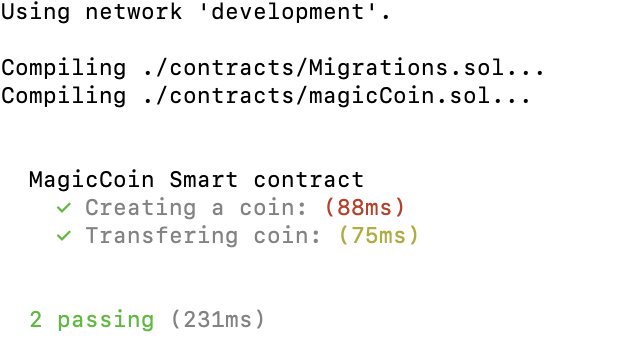

# smartContractExample
A smart contract that allows you to create and transfer a dummy digital currency called Magic Coin.

## Usage:
- In one terminal run the following command:
`ganache-cli -i development`
- In the project directory, run the following command:
`truffle test ./test/magicCoin.test.js`

## Coding Instructions:

### How to create your first smart contract:
- `mkdir smartContractExample`
- `cd smartContractExample`
- `truffle init`
- Create and edit __contracts/magicCoin.sol__. Add functions of your choice.
- `truffle compile`
- On a separate terminal, run `ganache-cli`
- Create and edit __migrations/2_deploy_contracts.js__
     `var magicCoin = artifacts.require('magicCoin');`
     `module.exports = function(deployer) {`
        `deployer.deploy(magicCoin);`
     `}`
- Edit __truffle-config.js file__
    `networks: {`
    > `development: {`
    > `host: "localhost",     // Localhost (default: none)`
    > `port: 8545,            // Standard Ethereum port (default: none)`
    > `network_id: "*",       // Any network (default: none)`
    `}`
- In the project directory, run `truffle migrate`

### Testing a smart contract:
- create and edit test/magicCoin.test.js
- In the main project directory, run:
`truffle test ./test/magicCoin.test.js`

### Results ###

## Useful links:
https://medium.com/@gus_tavo_guim/testing-your-smart-contracts-with-javascript-40d4edc2abed

